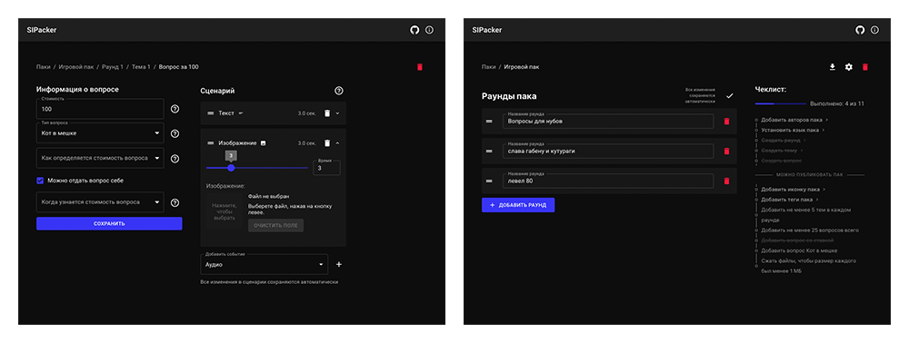
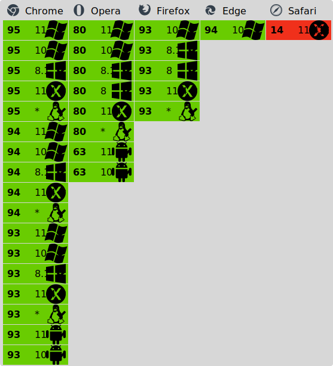

# SIPacker


-0%25-red)

Онлайн-редактор паков для Своей Игры (SiGame Владимиря Хиля)

> [!CAUTION]
> ПРОЕКТ НЕ ПОДДЕРЖИВАЕТСЯ И СОДЕРЖИТ НЕКОТОРЫЕ ПРОБЛЕМЫ С ГЕНЕРАЦИЕЙ ПАКОВ! см. https://git.hloth.dev/hloth/sipacker/issues/42

<p align="center">
  
</p>

> [!IMPORTANT]
> Я ищу работу! Если вы заинтересованы в моем найме, посетите [cv.hloth.dev](https://cv.hloth.dev), чтобы просмотреть мои резюме и CV.

## Развернутая версия

[sipacker.netlify.app](https://sipacker.netlify.app)

Все обновления с ветки master загружаются на развернутую версию автоматически в течение 5 минут.

*(Переехали с Github Pages из-за отсутствия возможности перенаправить весь трафик в корень сайта)*

## Сравнение SIPacker с другими редакторами

<!-- ✅ ❌ ⏳ -->

[SIQuester](https://vladimirkhil.com/si/siquester) — официальный редактор паков для Своей Игры

&nbsp;|SIPacker|SIQuester
---|---|---
Запуск на macOS, Linux, Android<sup>1</sup>|✅|❌
Импорт паков по URL|✅|❌
Мгновенное сжатие изображений|✅|❌
Интеграция с sigame.ru|⏳|❌
Работает офлайн|✅|✅
Импорт и экспорт siq-файлов паков|✅|✅
Поддержка всех типов вопросов|✅|✅
Поддержка текста, аудио и видео файлов|✅|✅
Поддержка external-ресурсов|✅|✅
Экспорт в HTML, xml, docx, rtf, xps, текст|❌|✅
Экспорт файла для отправки на ТВ-версию игры, СНС|❌|✅
Объединение паков|❌|✅
Ограничение на один медиа-файл|от 500 МБ до 2 ГБ<sup>2</sup>|Фото: 25 кб, музыка: 500 кб
Ограничение на медиа-файлы во всем приложении|250 МБ (или до 1 ГБ<sup>3</sup>)|Неограниченно


<sup>1</sup> — .NET, необходимый для компиляции исходного кода SIQuester, возможно скачать на Mac и Linux, самостоятельно скомпилировать код и запустить на этих системах, но инструкции о том, как правильно скомпилировать проект не прилагаются, а UI может не работать из-за разных ОС

<sup>2</sup> — Firefox: 800 МБ, Google Chrome: 2 ГБ, Google Chrome (Android): ОЗУ/5, Opera: 500 МБ. Рекомендуется не загружать файлы размером больше 1 МБ, а размер пака не должен превышать 100 МБ.

<sup>3</sup> — Пользователь может сам настроить лимит на размер IndexedDB на домен в настройках браузера

## Запуск локально

Если по какой-то причине развернутая версия вам не подходит, то вы можете развернуть приложение самостоятельно:

1. Выберите ветку: master (стабильная) или dev (разработка). Остальные ветки временные и предназначены для больших изменений, которые впоследствие могут быть или отменены или добавлены в ветку dev. Перейдите на страницу выбранной ветки

2. Скачайте репозиторий как zip или клонируйте его

3. Введите команду, которая выведет результат в папку build
```
$ npm run build
```
\
Если необходимо сделать билд с префиксом в url, установите его в переменной PUBLIC_URL с косой чертой в начале, но без неё в конце.
```
$ PUBLIC_URL=/SIPacker npm run build
```

## Запуск с фейковым доменом

Если вам интересно, как запустить SIPacker с фейковым доменом и самоподписанным сертификатом (например https://sipacker.test без загрузки в веб), прочитайте инструкцию [/keys/Instructions.txt](/keys/Instructions.txt)

## Поддержка браузерами



Если вы все еще пользуетесь Safari то просто пожалуйста прекратите. Вот неполный список того, что не будет работать в SIPacker, открытом в Safari:

- Размер всех медиа-файлов и самого пака ограничен всего до 30 МБ (это также распространяется на external-ресурсы и импортируемые паки)
- Кеш external-ресурсов, чтобы можно было работать с ним офлайн
- Вероятно, корректное воспроизведение аудио и видео файлов
- Шрифты и многие аспекты дизайна, верстка
- Возможны баги с компрессией файлов

## Contributing

Не надо

## Спонсирование

Пожалуйста задонатьте мне пожалуйста [https://donate.qiwi.com/payin/vityaschel](https://donate.qiwi.com/payin/vityaschel) прошу вас пожалуйста.
