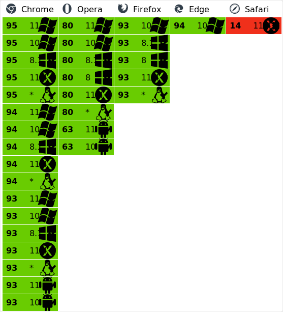

# SIPacker

Онлайн-редактор паков для Своей Игры (SiGame Владимиря Хиля)

<p align="center">
  
</p>

## Развернутая версия

[https://vityaschel.github.io/SIPacker](https://vityaschel.github.io/SIPacker) (ветка gh-pages)

## Сравнение с другими редакторами

<!-- ✅ ❌ ⏳ -->

[SIQuester](https://vladimirkhil.com/si/siquester) — официальный клиент

&nbsp;|SIPacker|SIQuester
---|---|---
Запуск на macOS, Linux, Android<sup>1</sup>|✅|❌
Мгновенное сжатие изображений|✅|❌
Интеграция с sigame.ru|⏳|❌
Работает офлайн|✅|✅
Импорт и экспорт siq-файлов паков|⏳|✅
Поддержка всех типов вопросов|✅|✅
Поддержка текста, аудио и видео файлов|⏳|✅
Поддержка external-ресурсов|✅|✅
Экспорт в HTML, xml, docx, rtf, xps, текст|❌|✅
Экспорт файла для отправки на ТВ-версию игры, СНС|❌|✅
Объединение пакетов|❌|✅
Ограничение на один медиа-файл|от 500 МБ до 2 ГБ<sup>2</sup>|Фото: 25 кб, музыка: 500 кб
Ограничение на медиа-файлы во всем приложении|250 МБ (или до 1 ГБ<sup>3</sup>)|Неограниченно


<sup>1</sup> — .NET, необходимый для компиляции исходного кода SIQuester, возможно скачать на Mac и Linux, самостоятельно скомпилировать код и запустить на этих системах, но инструкции о том, как правильно скомпилировать проект не прилагаются, а UI может не работать из-за разных ОС

<sup>2</sup> — Firefox: 800 МБ, Google Chrome: 2 ГБ, Google Chrome (Android): ОЗУ/5, Opera: 500 МБ. Рекомендуется не загружать файлы размером больше 1 МБ, а размер пака не должен превышать 100 МБ.

<sup>3</sup> — Пользователь может сам настроить лимит на размер IndexedDB на домен в настройках браузера

## Запуск локально

Если по какой-то причине развернутая версия вам не подходит, то вы можете развернуть приложение самостоятельно:

### Способ 1: Готовый стабильный билд

1. Откройте ветку [gh-pages](https://github.com/VityaSchel/SIPacker/tree/gh-pages) на GitHub
2. Скачайте репозиторий как zip или клонируйте его
3. Запустите сервер на localhost: для этого установите js-библиотеку [http-server](https://www.npmjs.com/package/http-server). [Как установить npx?](https://www.npmjs.com/package/npx)
\
Введите эту команду, которая запустит локальный сервер на порте 8080:
```
npx http-server
```
На ветке gh-pages всегда развернута та же версия, что и на ветке master (стабильная).

### Способ 2: Компилирование любой ветки

1. Выберете ветку: master (стабильная) или dev (разработка). Остальные ветки, кроме gh-pages, временные и предназначены для больших изменений, которые впоследствие могут быть или отменены или добавлены в ветку dev. Перейдите на страницу выбранной ветки

2. Скачайте репозиторий как zip или клонируйте его

3. Введите команду, которая выведет результат в папку build
```
$ npm run build
```
\
Если необходимо сделать билд с префиксом в url, установите его в переменной REACT_APP_PREFIX с косой чертой в начале, но без неё в конце.
```
$ REACT_APP_PREFIX=/SIPacker npm run build
```

## Поддержка браузерами



## Contributing

Не надо

## Спонсирование

Пожалуйста задонатьте мне пожалуйста [https://donationalerts.com/r/vityaschel](https://donationalerts.com/r/vityaschel).

Как только получу статус самозанятого так сразу перейду куда-то еще, а пока будьте добры донатить не меньше 250 руб чтобы я мог их вывести :)))